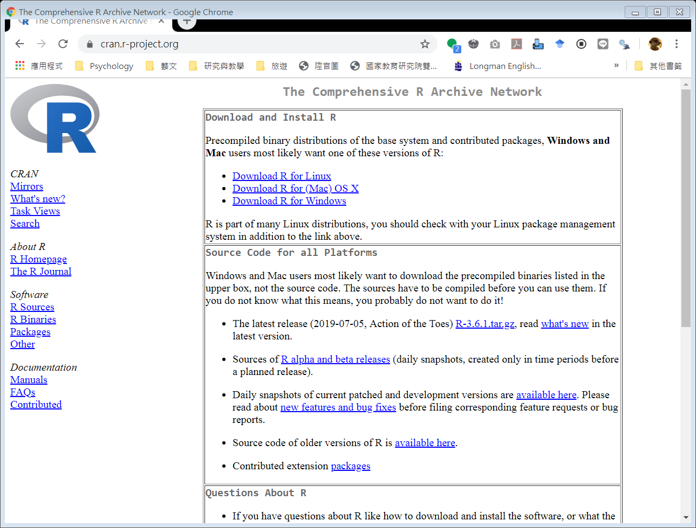
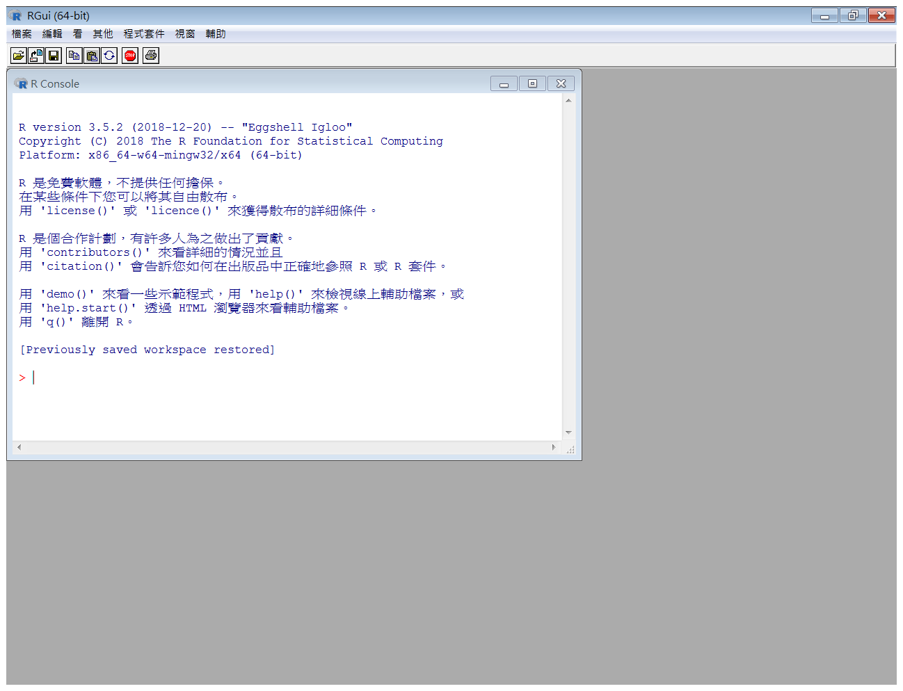
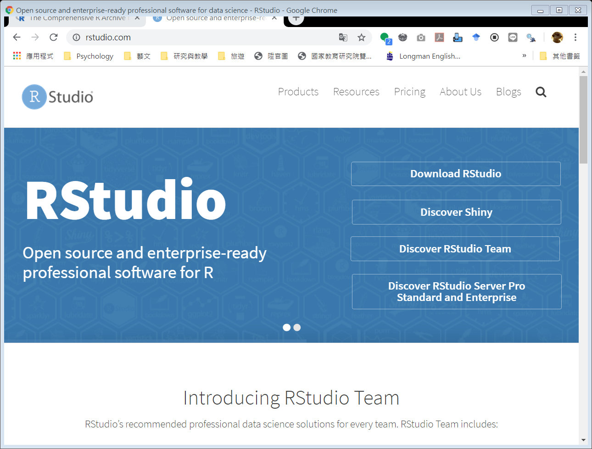
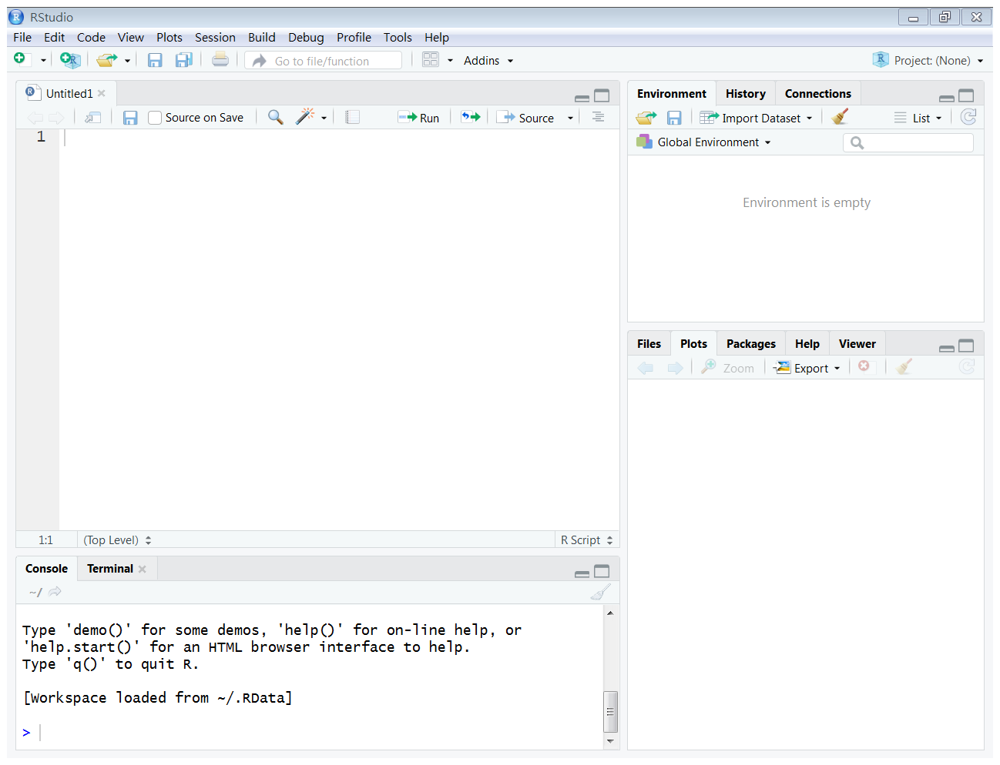
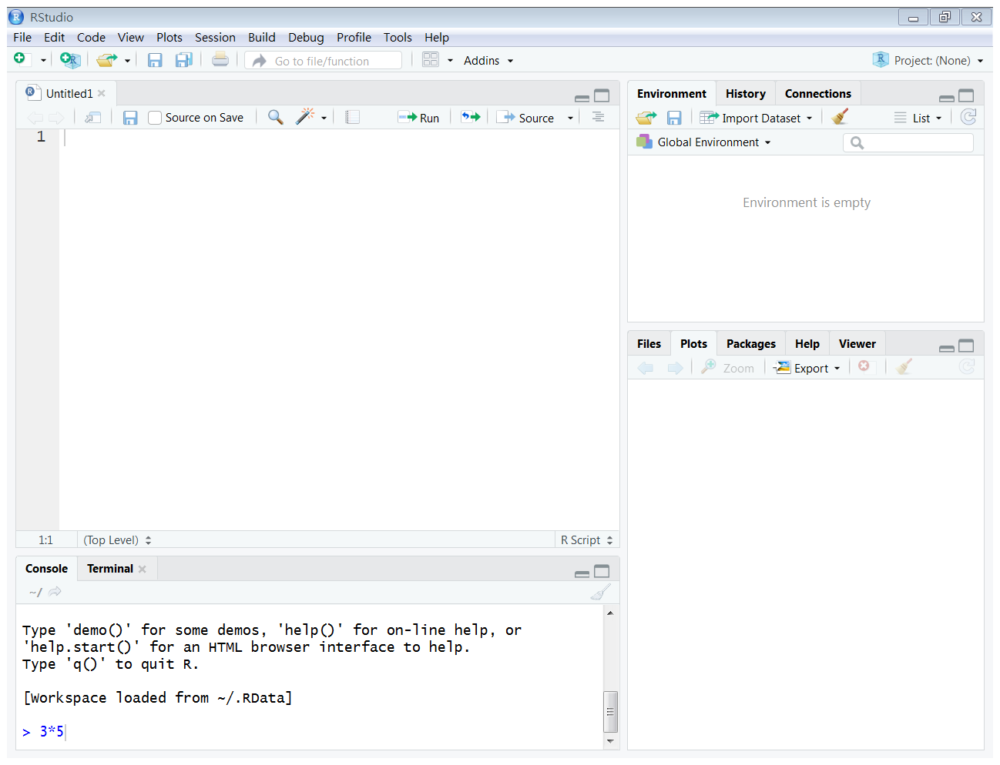
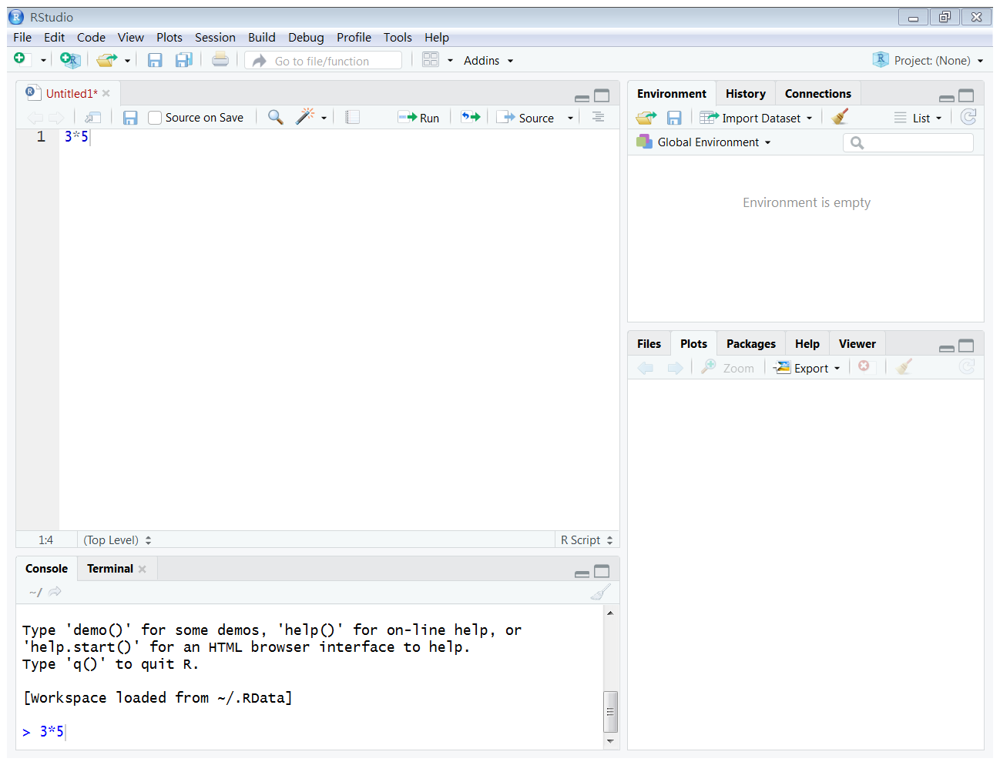
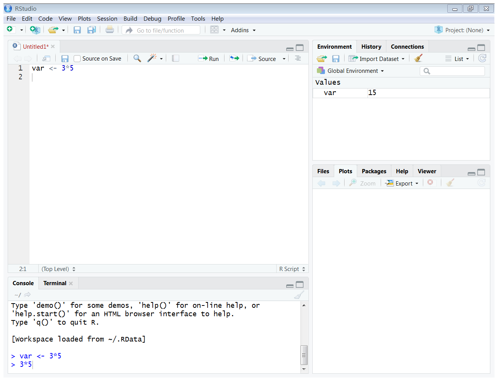
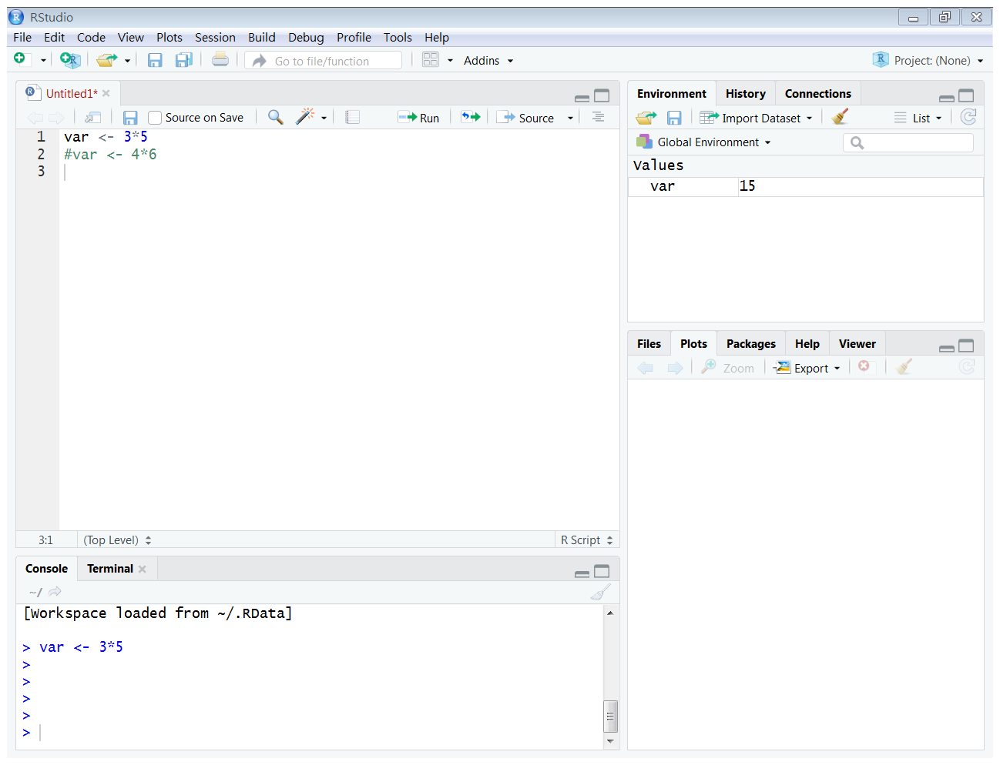
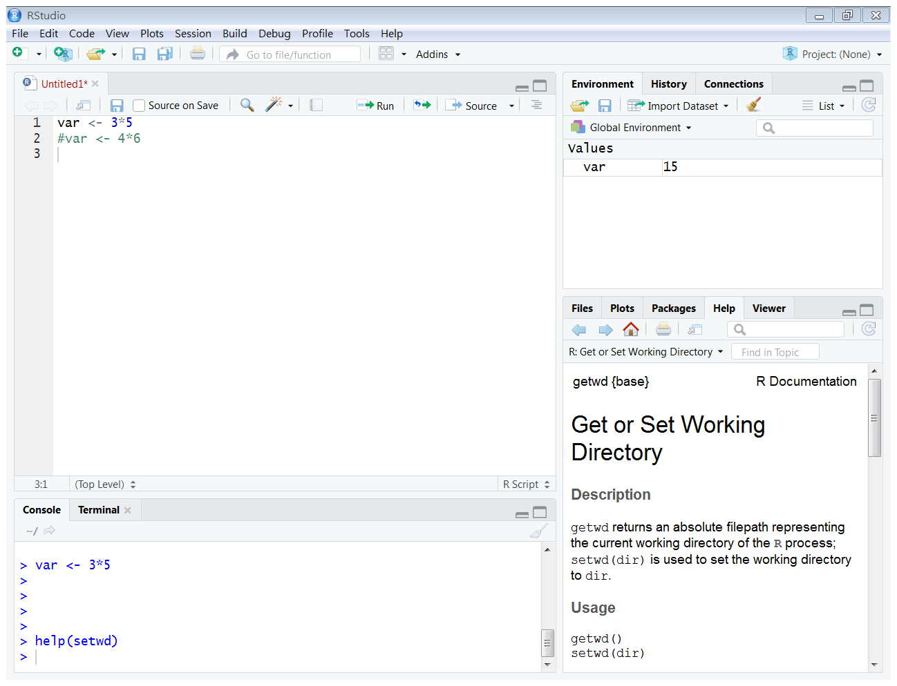
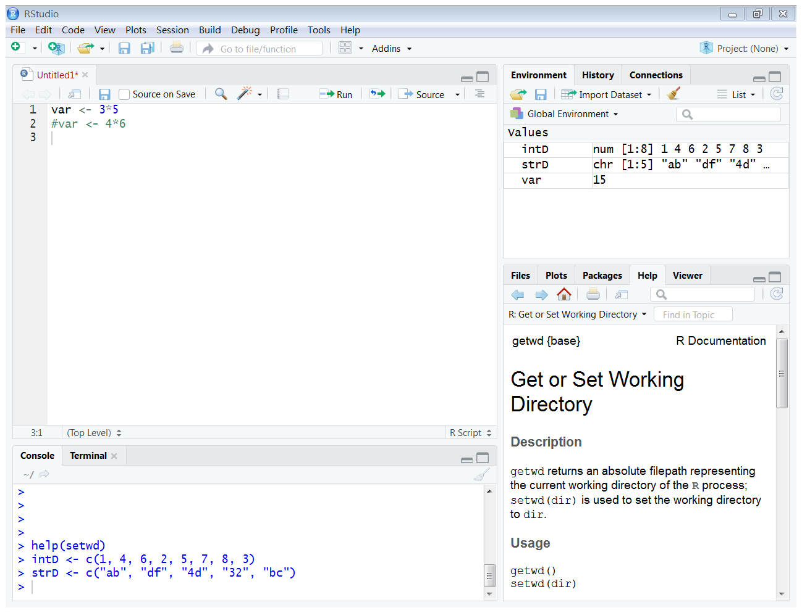

# R語言的基本概念與語法 {#intro}

## 課程簡介 {-}

### 課程簡介 {-}

- 本次課程為R語言的基礎介紹
- 主要目的在熟悉R語言的環境與基本用法
- 重點在R語言的基本與特殊的資料型態

### 學習目標 {-}

- 能夠安裝R 語言的開發環境，包括核心程式以及整合開發環境(Integrated Development Environment, IDE) RStudio
- 能夠運用RStudio 撰寫R 語言的指令
- 能夠區別R 語言的各種基本資料型態：integer、numeric、character、logic、factor
- 能夠區別R 語言的各種進階資料型態：vector、matrix、array、list、data frame

## R語言的基本概念

**R語言簡介**

R語言是一種自由的軟體程式語言，可用於統計分析、資料探勘、資料視覺化。R語言本身便具有多種統計及資料分析功能，再加上許多統計學家與資料科學家的努力，撰寫了許多強大功能的套件(package)。使用者只要熟知R語言的語法、指令和套件，便能輕易完成許多於統計分析、資料探勘、資料視覺化的任務。

**R語言的資源中心**

CRAN (The Comprehensive R Archive Network) 是R語言的資源中心，使用者可以在這個網站中下載R語言的執行檔、原始碼和說明文件，CRAN也收錄了各種套件。



請進行下面的步驟安裝R語言的核心程式：

- 請連線到[CRAN](https://cran.r-project.org/)
- 點選Download R for (Mac) OS X 或Download for Windows 連結，下載R語言的核心程式，進行安裝
- 注意目前的版本(R語言常常會有新的版本釋出，若有需要可下載更新)

安裝成功的R語言的核心程式


**R的編寫介面**

R本身的介面不容易用於開發程式，因此R語言的愛好者，開發了許多整合開發環境(Integrated Development Environment, IDE)，其中RStudio是較著名的一個。



請進行下面的步驟安裝RStudio

- 請連線到[RStudio](https://www.rstudio.com/)
- 點選Products 下的RStudio 下載，安裝RStudio

**Rstudio的儀表板**

請開啟RStudio



- Console：執行敘述，呈現敘述執行的結果 (左下)
- Source：開發程式開發 (左上)
- Environment：目前使用的變數與自行定義的函數 (右上)
- Help：查詢函數 (右下)
- Plots：繪圖 (右下)

## R語言的運算

R語言的**運算式**由常數(constants)、變數(variables)、運算子(operators)和函數(functions)等構成，運算式的計算會得到一個結果。

- 如果運算式相當簡單的話，可以在RStudio的Console上，直接執行運算。例如：請在RStudio的Console處輸入以下運算式：



``` {r}
3*5
```

- 如果運算式較複雜或是有需要重複運用，則建議寫成Script，並利用Script右上方的**Run**進行運算。例如：請在RStudio的Script處輸入以下運算式，並且點選Script右上方的Run：



``` {r}
3*5
```

**指定敘述**

可將運算式的結果儲存在某一個變數內，稱為指定敘述。例如：請在Console處輸入下面的指定敘述

``` {r}
var <- 3*5
```

上面的指定敘述裡， `<-`的意思是將右邊運算式(3*5)的結果指定給左邊的變數(var)儲存。執行完後，可以在右上的Environment，查看變數var儲存的數值



**註解**

在R語言裡，`#`後的文字被忽略。例如：在Console處輸入下面的敘述

``` {r}
#var <- 4*6
```
在右上的Environment，查看變數var儲存的數值。此時可以發現新的敘述並沒有覆蓋舊的指定敘述。



**查詢與設定工作目錄**

通常開始一個任務時，會將相關的程式和資料儲存在同一個資料夾，稱為**工作目錄**。使用工作目錄進行任務，可以減少不少錯誤發生，提高工作效率。

- 在Console上，設定工作目錄

``` {r eval=FALSE}
setwd("C:/工作路徑/rCourse/任務X")
```

- 查看目前的工作目錄
``` {r eval=FALSE}
getwd()
```

事實上，`setwd`和`getwd`都是**函數(function)**。在R語言裡，函數的使用相當重要。

**練習**

試著在檔案總管中建立一個新的資料夾，並且使用`setwd()`將該資料夾設定為工作目錄。

**Help**

在Console上，查看某一個函數的用法

``` {r eval=FALSE}
help(setwd)
```



右下的Help 出現有關這個函數的解說

另一種常用的寫法
``` {r eval=FALSE}
?setwd
```

## R語言的基本資料型態

R語言的基本資料型態包含

- integer
- numeric
- character
- logic
- factor

### 數值資料型態

integer 與 numeric屬於數值資料型態。數值資料的運算有

- `+` 加
- `-` 減
- `*` 乘
- `/` 除
- `^` 次方
- `%%` 整數除法的餘數
- `%/%` 整數除法的商
    
**練習**

請在Console下輸入下面的敘述，分別查看c, d, e，說明為何c, d, e 的數值為何不同？

``` {r}
a <- 5
b <- 3
c <- 5/3
d <- 5%/%3
e <- 5%%3
```

數值資料常見的函數有

- abs() 絕對值
- sqrt() 平方根
- round() 四捨五入

**注意**：函數是學習程式語言裡最重要的一個環節，會使用函數的話，可以大大節省開發的時間和精力。很多函數都是已經開發好的，但有必要的話，也可以自行開發。已經開發的函數又可以分為兩類，一類是系統本身提供的函數，或是由其他人員寫好的套件(package)。目前我們使用的函數都是系統本身提供的函數，日後會大量使用套件，也會自行開發函數。

**練習**

請在Console下輸入下面的敘述

``` {r}
sqrt(2^4)
round(c)
```

**說明**：函數括號裡的資料稱為參數(parameter)。輸入參數，經由函數運算，得到結果。

### 文字資料型態

character為文字資料型態。在Console上輸入下面指定敘述，並且查看str1和str2

``` {r}
str1 <- "R"
str2 <- "Language"
```

常用的character函數有

- `nchar()` 字串內有多少字
- `paste()` 字串連接
- `substr()` 取出字串的一部份

**練習**

在Console上輸入下面敘述，並且查看運算結果

``` {r}
nchar(str1)
paste(str1, str2)
substr(str2, 1, 4)
```

### 邏輯資料型態

邏輯資料型態的值只有兩種：TRUE(真)與FALSE(偽)。邏輯運算有

- `|` 或
- `&` 且
- `!` 否
    
**練習**

在Console上輸入下面敘述，並且查看運算結果

``` {r}
log1 <- 3>5
log2 <- "R Language" == paste(str1, str2)
log1 | log2
log1 & log2
```

### factor資料型態

factor資料型態可用於表示名目尺度的資料。在Console上輸入下面敘述，並且查看運算結果

```{r}
gender_data <- c(2, 1, 2, 2, 1, 1)
gender <- factor(gender_data, labels=c("女", "男"))
```

上面的例子中，依照數值資料的順序，1代表女生，2代表男生。

如果要設定2代表女生，1代表男生，，可以用下面的方法：

```{r}
gender <- factor(gender_data, labels=c("女", "男"), levels=c(2, 1))
```

## R語言的特殊資料型態

R語言中常會使用下列的特殊資料型態

- vector
- matrix
- list
- data frame

### vector

vector是一序列相同型態的資料。在Console上輸入下面敘述，並且查看運算結果

``` {r}
intD <- c(1, 4, 6, 2, 5, 7, 8, 3)
strD <- c("ab", "df", "4d", "32", "bc")
```

在右側的Environment上，觀察vector可以發現：`intD`為num[1:8]，而`strD`為chr[1:5]。num和chr分別表示numeric和character資料型態；[1:8]和 [1:5]則是vector的範圍。



---

vector 上的元素，可以按照其位置取得，甚至替換

``` {r}
intD[4]
intD[2:5]
intD[c(1,3,5)]
```

- `intD[4]`表示intD的第4個元素
- `intD[2:5]`表示intD的第2到第5個元素
- `intD[c(1,3,5)]`表示intD的第1、3、5個元素

---

vector的運算會針對vector上的每一個資料，逐一進行運算。當兩個vector進行運算時，較短的vector會自動延長，以便兩個vector上面的元素一一對應

``` {r}
intD * 5
intD + c(1, 2, 3, 4, 5, 6, 7, 8)
intD + c(1, 2, 3, 4)
```

---

函數`c()`可以合併vectors

``` {r}
c(intD, c(1, 2, 3, 4))
```

---

函數`length()`可以計算vector長度，也就是vector上的元素個數

``` {r}
length(intD)
```

---

函數`sum()`可以計算vector上的元素總和

``` {r}
sum(intD)
```

---

函數`sort()`可以對vector上的元素排序

``` {r}
sort(intD)
sort(intD, decreasing=TRUE)
```

`sort()`中預設的`decreasing`參數為FALSE，將vector裡的元素**由小到大**排序。如果將`decreasing`設為TRUE，則會將vector裡的元素**由大到小**排列。

---

函數`order()`可以找出vector中的元素在由小到大順序中的位置。
* 在Console上輸入下面敘述，並且查看運算結果

``` {r}
order(intD)
```

所以另一種將intD的元素由小到大排序的方法是

``` {r}
intD[order(intD)]
```

如果在函數`order()`中，將`decreasing`參數設為TRUE，則先將vector中的元素反轉，再找出其順序，以找出由大到小的位置。

``` {r}
order(intD, decreasing=TRUE)
```

---

函數`seq()`可以產生等差序列的vector。`seq()`包括`from`, `to`, `by`等參數，意思是從開始的數值from，在不超過結尾數值to的情形下，每次增加一個數值by

``` {r}
seq(1, 8)
seq(1, 8, 2)
seq(1, 8, 1.5)
```
- seq(1, 8): from=1, to=8
- seq(1, 8, 2): from=1, to=8, by=2
- seq(1, 8, 1.5): from=1, to=8, by=1.5

如果`by`為1時，可以用冒號運算式`:`

``` {r}
1:8
```

---

函數`rep()`可以產生重複序列的vector。`rep()`包括`x`和`times`兩個參數，意思是將x重複times次。

``` {r}
rep(1, 9)
rep(1:2, 4)
rep(c(4, 82, 53), 3)
```

**練習**
產生以下的數列

- 1到10間所有的整數
- 1到10間所有的奇數
- 1到10間所有的偶數
- 1到10間所有3的倍數
- 2的1到10乘方

**進階研究**
在R語言中，可以使用`pi`取得圓周率，嘗試用以下的方法畫出一個圓來

- 首先將圓分為360等份，產生圓上的每一個角度
```{r}
pnt <- (2*pi)/360*(0:360)
```

- 每一個角度的X軸坐標為`sin(pnt)`，Y軸坐標為`cos(pnt)`。
```{r eval=FALSE}
sin(pnt)
cos(pnt)
```

- 利用plot函數畫圖
```{r}
plot(sin(pnt), cos(pnt), type="l", xlab="", ylab="", asp=1)
```

### matrix

matrix可以視為是2維的vector，也就是包含列與行

``` {r}
matrix(1:12, nrow=4)
```

函數`matrix()`可以產生matrix資料型態。`matrix()`的參數有`data`, `nrow`, `ncol`和`byrow`，意思是將data上的資料表示成nrow列或ncol行的matrix。

在matrix裡，橫列稱為row，直行稱為col。

上面的matrix是以column為主排列，如果要以row為主來排列matrix的話，可以寫成

``` {r}
matrix(1:12, nrow=4, byrow=TRUE)
```

也就是`matrix(data, nrow, ncol, byrow)`：將data上的資料表示成nrow列或ncol行的matrix
- byrow=FALSE(預設值)，直行優先排列
- byrow=TRUE，橫列優先排列

---

如果要取用matrix上的元素

``` {r}
intMatrix <- matrix(1:12, nrow=4, byrow=TRUE)
intMatrix[1,] # 第一列
intMatrix[,2] # 第二行
intMatrix[3,1] # 第三列第一行
```

---

matrix上的運算

- 函數`rowSums()`可以計算matrix的每一橫列上的元素總和
- 函數`colSums()`可以計算matrix的每一直行上的元素總和
- 函數`sum()`可以計算x上的元素總和

``` {r}
rowSums(intMatrix) # 每列上元素總和
colSums(intMatrix) # 每行上元素總和
sum(intMatrix)     # 所有元素總和
```

---

函數`t()`可以轉置matrix，原先的行做為列，列做為行

``` {r}
t(intMatrix)
```

---

函數`diag(x)`可以計算matrix的對角線

``` {r}
diag(intMatrix)
```

### list
list可以包含不同資料型態的一序列資料

``` {r}
spiderman <- list(id = "012",
                  name = "Peter",
                  team = "Avengers",
                  height = 178,
                  weight = 76)
spiderman
```

---

取得list上的資料有幾種方法

- 根據資料在list上的位置
``` {r}
spiderman[[3]]
```

- 根據資料在list上的名稱
``` {r}
spiderman[["team"]]
```

- 另一種根據資料在list上的名稱的方法
``` {r}
spiderman$team
```

### data frame
data frame是可以包含不同資料型態的資料集合

```{r}
id <- c("001", "002", "003", "004", "005")
name <- c("superman", "batman", "spiderman", "wolverine", "wonderwoman")
height <- c(190, 188, 178, 150, 183)
weight <- c(102, 95, 76, 88, 59)
gender <- c("Male", "Male", "Male", "Male", "Female")
heroes <- data.frame(id, name, height, weight, gender)

heroes
```
data.frame為2個維度的資料型態。橫列為row，在R語言裡稱為Observation；直行為column，稱為Variable

---

data frame上的Variable

``` {r}
colnames(heroes)
```

---

data frame的資料數量

``` {r}
nrow(heroes)
ncol(heroes)
dim(heroes)
```

---

data frame上各Variable的資料型態

``` {r}
str(heroes)
```

比較id, name及gender等欄位的資料型態
``` {r}
str(id)
str(name)
str(gender)
```
從上面，可以發現產生data frame的過程中，字串(character)自動被轉換成factor

如果要在data frame中保持字串資料類型
``` {r}
heroes <- data.frame(id, name, height, weight, gender,
                     stringsAsFactors = FALSE)
str(heroes)
```
* stringsAsFacotrs=FALSE(設定在data frame中保持字串資料類型)

---

如同取得list上的資料，取得data frame上的資料也可以分為根據位置和根據名稱。

- 根據data frame上的位置(第幾列、第幾行)

``` {r}
heroes[2, ]
heroes[,2]
heroes[2, 2]
```

- 根據data frame上的名稱

``` {r}
heroes[["name"]]
```

或是

``` {r}
heroes$name
```

另外還可以根據索引(data frame上符合索引條件的紀錄)，取得data frame上的紀錄資料

``` {r}
heroes[heroes$name=="spiderman",]
```

**練習**
- 取得性別為女性的超級英雄
- 取得身高高於180cm的超級英雄

根據索引(data frame上符合索引條件的紀錄)

``` {r}
heroes[which.max(heroes$height),]
```

```{r}
which.max(heroes$height)
```
which.max(x)：傳回x中最大值的位置

**練習**

- 取得體重最重的超級英雄
- 取得體重最輕的超級英雄
- 取得名字最長的超級英雄

## 小結 {-}

- R語言中很重要的是使用函數來幫忙完成工作。在本次課程中，列舉出許多常用的函數，但還有更多的函數。面對這些函數，死背下來不是最好的方法！需要學習如何查找到適合的函數是學習R語言的訣竅。

- 在R語言的程式設計當中，vector與data frame是相當重要的資料型態，許多分析與計算都在vector或data frame上完成。下一節將主要著重在data frame為主的資料讀取與儲存。

## 延伸思考 {-}

- 為什麼要學程式設計？為什麼要學R 語言的程式設計？
- 有沒有學程式設計的訣竅？
