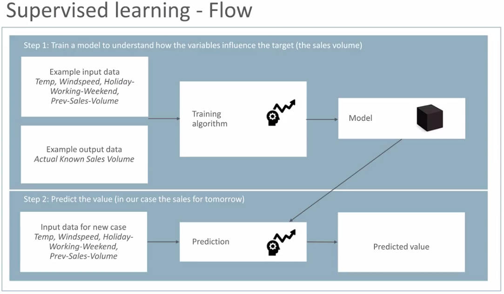

# 資料探勘在傳播學的應用案例 {#data_mining_case_study}

## 課程簡介 {-}

### 課程簡介 {-}
本次課程的目的為介紹資料探勘(data mining)的定義與實際上的應用步驟，並且說明資料探勘過程中機器學習(machine learnig)方法的類型，最後介紹若干資料探勘應用於傳播學的案例。本次課程包含以下的內容：

- 資料探勘簡介
- 機器學習方法的類型
- 應用資料探勘於傳播學的案例

### 學習目標 {-}

- 能夠解釋資料探勘的定義與過程
- 能夠指出機器學習方法的類型與適用問題
- 能夠說明各種機器學習方法適用的問題

## 資料探勘的定義

**資料探勘 (Data Mining)**是利用電腦演算法發掘大量資料中蘊藏的規律性、樣式或知識，以幫助人們了解與說明資料的特性或者應用規律性與樣式來預測新的資料。這些規律性與樣式，以一般人的認知能力通常並不容易發現。

---

一般來說，資料探勘的任務目的包括預測(prediction)、關連(association)、集群(clustering)、異常偵測(anomaly detection)等等。

- **預測**是根據蒐集的資料案例(examples)，以訓練演算法(training algorithm)建立一個模型(model)，來判斷新的資料可能的輸出資訊，蒐集的資料案例一般稱為訓練集(training set)資料。預測的輸出資訊可能是新資料上的某一個未知數值或是實體所屬的類別。輸出資訊為數據時，這種問題又稱為**迴歸(regression)**；當預測的目的是判斷資料的類別時，這種資料探勘任務則稱為**分類(classification)**。比較著名的預測例子，根據天氣預報資料以及地區以往雨具銷售情形，判斷未來一段時間內的雨具銷售。又如垃圾郵件偵測，便是從一些已經標示為垃圾郵件與非垃圾郵件的文字資料訓練出模型來判斷新進郵件是否為垃圾郵件。

- **關連**是發現在訓練資料中經常一起出現的一組特徵，最有名的例子便是運用購物籃分析(market basket analysis)發現啤酒與尿布的關連。

- **集群**是根據資料之間的相似性(或者距離)，找出一種將資料劃分成若干群的方式，盡可能使得群內的資料彼此間的相似性大於任何群外的資料 (或是彼此間的距離小於群外的距離)。

相關的例子有根據詞語的上下文資訊找出語意相關的詞語集群。舉例而言，政治、經濟、財稅金融、影視娛樂、運動或者醫療健康等相同文類的詞語它們彼此的上下文資訊應當很相像，但和其他文類的詞語會有相當不同的上下文資訊，因此可以依據上下文資訊對詞語進行集群分析。未來會有一章專門介紹詞語的集群分析。

- **異常偵測**則是發現某一些資料，其特性與其他多數者明顯不同。例如從信用卡的交易資料中發現盜刷的交易，或是找出健保詐騙的醫療處方箋。

## 資料探勘的步驟

資料探勘的目的可以定義為一個從資料庫中發現知識的過程 (Knowledge Discovering in Databases, KDD)，依據Fayyad等人於1996年提出的構想，整個KDD過程包括

1. 選取資料 (Selection)
2. 資料的清除與整理等前處理 (Preprocessing)
3. 轉換資料為有效描述和預測的特徵 (Transformation)
4. 運用機器學習(machine learning)的技術建立資料模型 (狹義的資料探勘) (Data Mining)
5. 解釋、評估與應用 (Intepretation/Evaluation)

## 資料探勘的分類

資料探勘的過程中運用從過去的經驗(experiences)中提取新知(new knowledge)的技術，這些技術稱為機器學習(machine learning)。機器學習大致可以區分成**監督式學習(supervised learning)**和**非監督式學習(unsupervised learning)**兩種。兩者的差別在於，前者在過程中需要提供加入人類事先對資料進行判斷的輸出訊息，用來做為預測未知資料的輸出訊息；後者則由電腦依據訓練資料的特性，歸納出可能的訊息，事先無須提供人為判斷的訊息。因此，以所需人力而言，監督式學習在訓練前需要較多專家對輸入的訓練資料給予對應的輸出資料，非監督式學習所需要的人力則多在於結果的詮釋。以前述資料探勘的應用目的而言，預測大多屬於監督式學習，而集群則一般認為是非監督式學習。

## 資料探勘於傳播學的應用

### 監督式機器學習

1. Flaounas, I., Ali, O., Lansdall-Welfare, T., De Bie, T., Mosdell, N., Lewis, J., & Cristianini, N. (2013). Research methods in the age of digital journalism: Massive-scale automated analysis of news-content—topics, style and gender. Digital Journalism, 1(1), 102-116.

2. Emery, S. L., Szczypka, G., Abril, E. P., Kim, Y., & Vera, L. (2014). Are you scared yet? Evaluating fear appeal messages in tweets about the tips campaign. Journal of Communication, 64(2), 278-295.

3. Rana, M. I., Khalid, S., & Akbar, M. U. (2014). News classification based on their headlines: A review. In 17th IEEE International Multi Topic Conference 2014 (pp. 211-216). IEEE.

4. Ott, M., Choi, Y., Cardie, C., & Hancock, J. T. (2011, June). Finding deceptive opinion spam by any stretch of the imagination. In Proceedings of the 49th Annual Meeting of the Association for Computational Linguistics: Human Language Technologies-Volume 1 (pp. 309-319). Association for Computational Linguistics.

5. De Choudhury, M., Gamon, M., Counts, S., & Horvitz, E. (2013). Predicting depression via social media. in Proceedings  of International AAAI Conference on Weblogs and Social Media, 13, 1-10.
### 非監督式機器學習
1. Evans, M. S. (2014). A computational approach to qualitative analysis in large textual datasets. PloS one, 9(2), e87908.

大眾媒體中假科學和非科學

2. Xu, G., Meng, Y., Chen, Z., Qiu, X., Wang, C., & Yao, H. (2019). Research on Topic Detection and Tracking for Online News Texts. IEEE Access, 7, 58407-58418.
