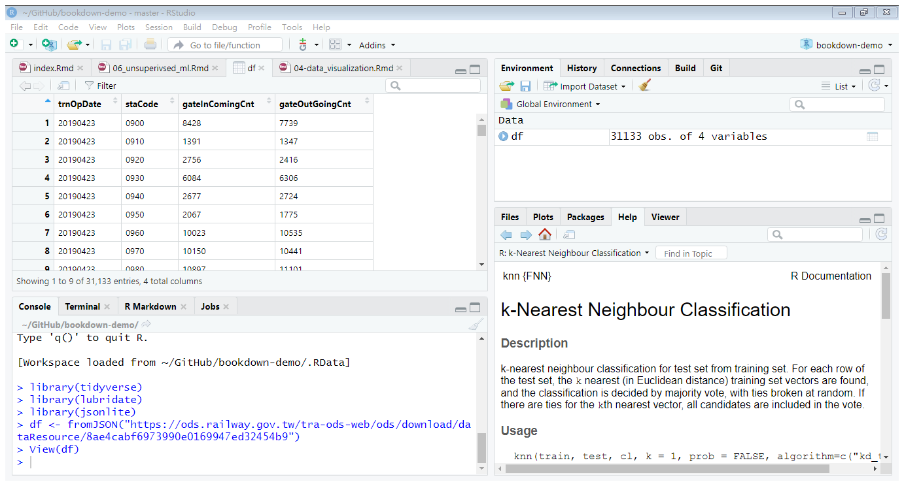
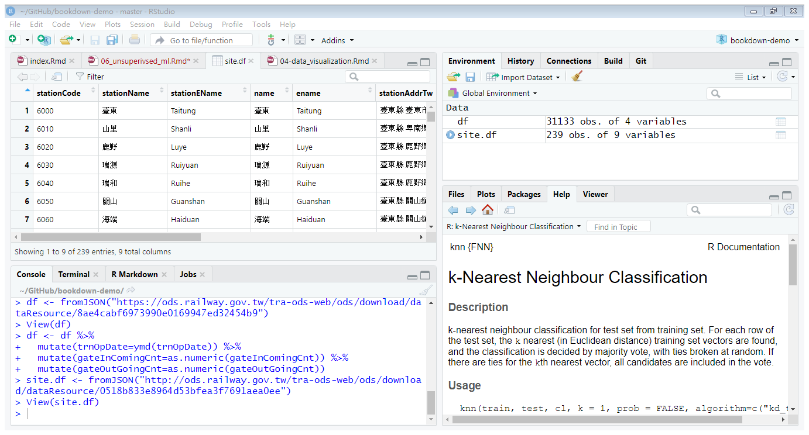
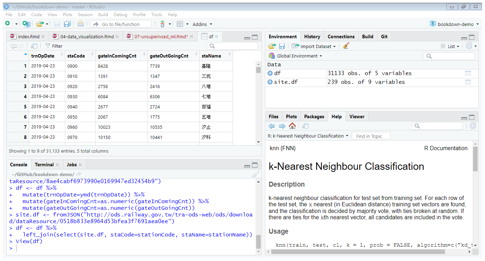

# 利用R語言進行非監督式機器學習 {#unsupervised_machine_learning}

## 課程簡介 {-}

### 課程簡介 {-}
本次課程的目的為介紹非監督式機器學習中的集群分析，並且利用臺鐵提供的各站點進出站人數統計資料，從統計資訊抽取特徵，做為主要車站的特徵，進行集群分析的練習。本次課程包含以下的內容：

- 集群分析簡介
- 集群分析AP (Affinity Propagation)演算法的應用

### 學習目標 {-}

- 能夠說明集群分析的概念，並選擇適用的問題
- 能夠應用AP演算法的套件apcluster進行集群分析

## 集群分析

如[資料探勘在傳播學的應用案例]所言，集群分析一種非監督式機器學習的資料探勘方法。其概念是根據資料的特性，設法找到一個可以良好地突顯資料的特徵間彼此相似性與相異性的方式。換言之，集群分析的結果是根據輸入資料特徵之間彼此的相似性，自動找到一種劃分方法使得特徵相似性較高的資料會被劃分在同一群組內，不在同一群組內的資料特徵之間相似性則比較低。


集群分析的演算法非常多，如

1. K-means
2. EM (expectation-maximization)
3. AHC (agglomerative hierarchical clustering, 聚合式階層集群)
4. DBSCAN
5. AP (affinity propagation)

本章將利用AP演算發，對台鐵各站點，依照進出站人數統計資料的相似性，進行集群分析。

AP演算法可參考
Bodenhofer, U., Kothmeier, A., & Hochreiter, S. (2011). APCluster: an R package for affinity propagation clustering. Bioinformatics, 27(17), 2463-2464.

## 以進出站人數統計資料對臺鐵主要車站進行集群分析

在政府開放資料平台上，臺鐵提供了每日各站點進出人數。

我們推測不同車站的定位事實上可能可以從它的進出人數上反應出來。例如某一個車站它的平常上班日比起週末假日有較多的進出人數，這個車站可能是提供給附近上班族通勤之用。如果在週末假日有較多的進出人數，而且週五、週六的出站人數比進站人數多，這個車站的旅客可能主要為返鄉遊子或旅行的遊客。在本章中，我們將利用臺鐵主要車站週一到週日每天進出人數的比例做為各車站的特徵，進行集群分析，將具有相似特徵的車站，聚集起來，分析與討論各車站的定位。

在本章的應用中，我們可以根據KDD過程中的各個步驟進行集群分析，個步驟為：

1. 選取資料 (Selection)
2. 資料的清除與整理等前處理 (Preprocessing)
3. 轉換資料為有效描述和預測的特徵 (Transformation)
4. 運用機器學習(machine learning)的技術建立資料模型 (狹義的資料探勘) (Data Mining)
5. 解釋、評估與應用 (Intepretation/Evaluation)


### 載入相關套件

首先載入輸入與處理資料的相關套件，因為臺鐵的資料多為JSON型式，所以載入JSON處理相關套件`jsonlite`。
```{r results='hide', message=FALSE, warning=FALSE}
library(tidyverse)
library(lubridate)
library(jsonlite)
```

### 選取資料

讀取臺鐵的[每日各站點進出人數](https://data.gov.tw/dataset/8792)資料。
```{r}
df <- fromJSON("https://ods.railway.gov.tw/tra-ods-web/ods/download/dataResource/8ae4cabf6973990e0169947ed32454b9")
```



查看資料型態
```{r}
summary(df)
```

- trnOpDate： 營運日期
- staCode： 車站代碼
- gateInComingCnt： 進站人數
- gateOutGoingCnt： 出站人數

將trnOpDate改變為日期資料型態，gateInComingCnt和gateOutGoingCnt則分別改為numeric資料型態。
```{r}
df <- df %>%
  mutate(trnOpDate=ymd(trnOpDate)) %>%
  mutate(gateInComingCnt=as.numeric(gateInComingCnt)) %>%
  mutate(gateOutGoingCnt=as.numeric(gateOutGoingCnt))
```

再查看一次資料型態
```{r}
summary(df)
```
---

因為出入站資料僅有包含車站代碼，所以從另外一個開放資料[車站基本資料集](https://data.gov.tw/dataset/33425)，讀取站點編號對應的名稱資料。
```{r}
site.df <- fromJSON("http://ods.railway.gov.tw/tra-ods-web/ods/download/dataResource/0518b833e8964d53bfea3f7691aea0ee")
```



將進出站點資料加入站點名稱。
```{r results='hide', message=FALSE, warning=FALSE}
df <- df %>%
  left_join(select(site.df, staCode=stationCode, staName=stationName))
```



是否有站點資料缺少站點名稱？
```{r results='hide'}
df[is.na(df$staName),]
```

刪除沒有站點名稱的資料
```{r}
df <- df %>%
  filter(!is.na(staName))
```

### 資料的清除與整理等前處理
首先查看資料的樣貌，並且修改可能的錯誤。

以臺北站為例，畫出每天的進出站人數情形
```{r}
df %>%
  filter(staName=="臺北") %>%
  gather(key=IO, value=Count, -staName, -staCode, -trnOpDate) %>%
  ggplot() +
  geom_line(aes(x=trnOpDate, y=Count, color=IO)) +
  scale_y_continuous(limits=c(0, 90000), breaks=seq(0, 90000, 10000)) +
  scale_color_brewer(palette="Dark2", labels=c("進站", "出站")) +
  labs(x="日期", y="進出站人數", color="進出") +
  theme(panel.background = element_blank(),
        axis.line = element_line(color="grey20"),
        panel.grid.major = element_line(color="grey90"))
```

**討論**

1. 資料分布的範圍？
2. 資料分布的樣式？
3. 是否有異常值(outliers)？

### 產生站點資料特徵


站點資料特徵便是用來一組描述站點特性的資料。

每個站點每天平均進出站人數
```{r}
df %>%
  group_by(staName) %>%
  summarise(In=mean(gateInComingCnt, trim=0.05), Out=mean(gateOutGoingCnt, trim=0.05)) %>%
  ungroup() %>%
  arrange(desc(In))
```

選取主要站點(每天平均進入人數達5000人以上)
```{r}
cand_sta <- df %>%
  group_by(staName) %>%
  summarise(In=mean(gateInComingCnt, trim=0.05), Out=mean(gateOutGoingCnt, trim=0.05)) %>%
  ungroup() %>%
  filter(In>=5000) %>%
  pull(staName)
```

從原始資料中取出中等規模以上站點的資料
```{r}
df1 <- df %>%
  filter(staName %in% cand_sta)
```

根據前面的折線圖，我們可以觀察到進出站人數具有週期性變化的情形，而其週期大約是一週(一星期)。所以可能可以以一週為單位，彙整資料，避免雜訊(某一天突然增加或減少的異常值)。檢視汐科站在一週每天的進出人數分布範圍。
```{r}
df1 %>%
  filter(staName=="汐科") %>%
  rename(In=gateInComingCnt, Out=gateOutGoingCnt) %>%
  gather(key="Var", value="Count", -staName, -staCode, -trnOpDate) %>%
  mutate(trnOpDateW=wday(trnOpDate, label=TRUE)) %>%
  ggplot() +
  geom_boxplot(aes(x=Var, y=Count)) +
  scale_x_discrete(labels=c("進站", "出站")) +
  scale_y_continuous(limits=c(0, 15000), breaks=seq(0, 15000, 3000)) +
  labs(x="", y="進出人數") +
  facet_wrap(~trnOpDateW, nrow=2) +
  theme(panel.background = element_blank(),
        axis.line = element_line(color="grey"))
```

再檢視臺東站在一週每天的進出人數分布範圍。
```{r}
df1 %>%
  filter(staName=="臺東") %>%
  rename(In=gateInComingCnt, Out=gateOutGoingCnt) %>%
  gather(key="Var", value="Count", -staName, -staCode, -trnOpDate) %>%
  mutate(trnOpDateW=wday(trnOpDate, label=TRUE)) %>%
  ggplot() +
  geom_boxplot(aes(x=Var, y=Count)) +
  scale_x_discrete(labels=c("進站", "出站")) +
  scale_y_continuous(limits=c(0, 15000), breaks=seq(0, 15000, 3000)) +
  labs(x="", y="進出人數") +
  facet_wrap(~trnOpDateW, nrow=2) +
  theme(panel.background = element_blank(),
        axis.line = element_line(color="grey"))
```

最後，檢視臺北站在一週每天的進出人數分布範圍。
```{r}
df1 %>%
  filter(staName=="臺北") %>%
  rename(In=gateInComingCnt, Out=gateOutGoingCnt) %>%
  gather(key="Var", value="Count", -staName, -staCode, -trnOpDate) %>%
  mutate(trnOpDateW=wday(trnOpDate, label=TRUE)) %>%
  ggplot() +
  geom_boxplot(aes(x=Var, y=Count)) +
  scale_x_discrete(labels=c("進站", "出站")) +
  scale_y_continuous(limits=c(0, 90000), breaks=seq(0, 90000, 10000)) +
  labs(x="", y="進出人數") +
  facet_wrap(~trnOpDateW, nrow=2) +
  theme(panel.background = element_blank(),
        axis.line = element_line(color="grey"))
```

注意週日和週五、週六與平日的情形，汐科站平日進出站人數多於週日和週六，每天的進出站人數大致相同；臺東站的週五和週六出站多於進站，週日則相反；臺北站的週五和週六則是進站多於出站；且臺北和臺東的週末進出人數都多於週間平日。

首先，計算每個站點在一週中每天的進出站人數平均值(刪除前後各5%的極端值以避免極端值的影響)。接著以長條圖顯示上述的進出站人數變化現象，。

```{r}
df1 %>%
  mutate(trnOpDateW=wday(trnOpDate, label=TRUE)) %>%
  group_by(staName, trnOpDateW) %>%
  summarise(In=mean(gateInComingCnt, trim=0.05), Out=mean(gateOutGoingCnt, trim=0.05)) %>%
  ungroup() %>%
  gather(key=variable, value=value, -staName, -trnOpDateW) %>%
  group_by(staName) %>%
  mutate(value=value/sum(value)) %>%
  filter(staName %in% c("汐科", "臺北", "臺東")) %>%
  ggplot() +
  geom_col(aes(x=trnOpDateW, y=value, fill=variable), position="dodge") +
  scale_fill_brewer(palette="Dark2", labels=c("進站", "出站")) +
  labs(x="週", y="人數佔全週進出人數比例", fill="進出") +
  facet_wrap(~staName, nrow=3) +
  theme(panel.background = element_blank(),
        axis.line = element_line(color="grey"),
        panel.grid.major = element_line(color="grey"))
```

從長條圖的示意可以觀察到產生的特徵保留上述分析的特性

以下的研究即利用這個觀察到的現象將資料分群。首先產生每一個站點的資料特徵。
```{r}
sta_inf <- df1 %>%
  mutate(trnOpDateW=wday(trnOpDate, locale="English", label=TRUE)) %>%
  group_by(staName, trnOpDateW) %>%
  summarise(In=mean(gateInComingCnt, trim=0.05), Out=mean(gateOutGoingCnt, trim=0.05)) %>%
  ungroup() %>%
  gather(key=variable, value=value, -staName, -trnOpDateW) %>%
  group_by(staName) %>%
  mutate(value=value/sum(value)) %>%
  ungroup() %>%
  unite(temp, trnOpDateW, variable) %>%
  spread(key=temp, value=value)
```

檢視產生的資料
```{r}
summary(sta_inf)
```

取出各站點的特徵(第2到最後一個variable)，形成特徵矩陣，用來計算站點間的相似性，也就是估計矩陣的列(row)與列是否相似。

```{r}
sta_inf.mat <- as.matrix(sta_inf[,2:ncol(sta_inf)])
```

### 維度縮減

上面產生的特徵共有14個維度(dimensions)，也就是14個variables。在計算站點間的相似性之前，可以先看看是否可以用比較少的維度，便達到相近的計算結果。這個從高維度轉換成低維度的運算稱為**維度縮減 (dimension reduction)**，是資料探勘中相當重要的步驟。許多研究對於維度縮減提出相當多不同的方法，在此我們選用**主成分分析 (principal component analysis, pca)**。

將資料特徵輸入R語言的主成分分析函數`prcomp()`。
```{r}
sta_inf.pca <- prcomp(sta_inf.mat)
```

主成分分析產生的結果為一組與原先相同維度的矩陣，以上例而言，其結果在`sta_inf.pca$x`。經過主成分分析後，第一個維度的特徵(稱為PC1)是最重要的資料描述方式，其次是最二個維度的特徵(PC2)，依序下來為PC3、PC4、...。

查看主成分分析產生結果的解釋
```{r}
summary(sta_inf.pca)
```
。其中的Standard deviation是只用這個維度上的特徵的標準差，可以利用標準差計算變異數所佔的比例(Proportion of Varience)，以第一個維度(PC1)來說，變異數所佔的比例約為0.84，也就是只用第一個維度的特徵便可以表現0.84的訊息，因此第一個維度是最重要的資料描述方式。第二個維度的變異數所佔的比例比第一個維度小，但比其他維度大，所以在資料描述方式上，它是第二重要的。以下依此類推。並且前三個維度(PC1、PC2和PC3)的變異數比例累積(Cumulative Proportion)約為0.96，也就是說只使用這三個維度便可以表現整個資料訊息的0.96。所以，以下的分析將使用前三個維度。

將各個維度的變異數比例累積畫成圖形來看。

```{r}
data.frame(dim_order=seq(1, ncol(sta_inf.mat)),
           var=sta_inf.pca$sdev^2) %>%
  mutate(prop_varex=var/sum(var)) %>%
  mutate(cum_prop_varex=cumsum(prop_varex)) %>%
  ggplot(aes(x=dim_order, y=cum_prop_varex)) +
  geom_line() +
  geom_point() +
  scale_x_continuous(limits=c(1, ncol(sta_inf.mat)), breaks=seq(1, ncol(sta_inf.mat), 1), minor_breaks = NULL) +
  scale_y_continuous(limits=c(0, 1), breaks=seq(0, 1, 0.1)) +
  labs(x="維度", y="累積變異數比例") +
  theme(panel.background = element_blank(),
        axis.line = element_line(color="gray"),
        panel.grid.major = element_line(color="gray70"),
        panel.grid.minor = element_line(color="gray90"))
```

取出經過前三個維度的資料。

```{r}
sta_inf.pf <- sta_inf.pca$x[, 1:3]
```

### 將站點依據彼此距離視覺化

本節中將依據站點彼此間的相似性，將各站點映射到圖形上，使相似性較大的站點在圖形上的距離較近

載入映射演算法套件
```{r results='hide', message=FALSE, warning=FALSE}
library(Rtsne)
```

計算站點之間的距離(相似性可以視為距離的負值，相似性愈大，距離愈小)。`dist()`提供矩陣的每列之間各種距離的計算方式，這裡我們採用內定而且是最常用的Euclidean distance(歐基里得距離)。
```{r}
sta_d <- dist(sta_inf.pf)
```

依據站點特徵之間的歐基里得距離計算站點映射在圖形上的位置
```{r}
tsne_out <- Rtsne(sta_d, perplexity=10, theta=0.0, is_distance=TRUE)
```

tsne對每個資料產生它在圖形上的映射位置，其結果放在一個行數為2的矩陣Y上，每一列分別代表分別表示一個資料在圖形上的坐標。例如：前五個站點在圖形上的坐標為
```{r}
tsne_out$Y[1:5,]
```

將每個站點加上它映射的坐標後，依據其坐標畫成圖形
```{r}
sta_inf %>%
  select(staName) %>%
  mutate(x=tsne_out$Y[,1], y=tsne_out$Y[,2]) %>%
  ggplot() +
  geom_text(aes(x=x, y=y, label=staName), size=3) +
  labs(x="", y="") +
  theme(panel.background = element_blank())
```

### 站點集群

載入Affinity Propagation集群演算法套件
```{r results='hide', message=FALSE, warning=FALSE}
library(apcluster)
```

AP集群演算法的輸入是資料項目間的相似性，所以我們利用前面計算得到的站點間的距離乘上-1，做為站點間的相似性。
```{r}
s1 <- -1*as.matrix(sta_d)
```

將站點間的相似性輸入AP集群演算法
```{r}
res <- apcluster(s1)
```

顯示集群分析的結果。Number of clusters是集群數量，Clusters是每個集群的成員，Exemplars是每個集群的核心成員。
```{r}
show(res)
```

查看每個集群內的站點
```{r}
for (i in seq(length(res@clusters))) {
  print(paste("Cluster", i))
  print(sta_inf$staName[res@clusters[[i]]])
}

```

將站點映射到相對應的坐標上，並以顏色區分它們的集群。
```{r}
sta_inf %>%
  select(staName) %>%
  mutate(x=tsne_out$Y[,1], y=tsne_out$Y[,2]) %>%
  mutate(cl=factor(labels(res, type="enum"))) %>%
  ggplot() +
  geom_text(aes(x=x, y=y, label=staName, color=cl), size=3) +
  scale_x_continuous(limits=c(min(tsne_out$Y[,1])-1, max(tsne_out$Y[,1])+1)) +
  scale_y_continuous(limits=c(min(tsne_out$Y[,2])-1, max(tsne_out$Y[,2])+1)) +
  scale_color_brewer(palette = "Dark2") +
  labs(x="", y="") +
  theme(panel.background = element_blank(),
        legend.position = "none",
        axis.line = element_line(color="grey"))
```

### 結果的解釋

集群的核心成員
```{r}
sta_inf$staName[res@exemplars]
```

```{r}
df1 %>%
  filter(staName %in% sta_inf$staName[res@exemplars]) %>%
  mutate(trnOpDateW=wday(trnOpDate, locale="English", label=TRUE)) %>%
  group_by(staName, trnOpDateW) %>%
  summarise(In=mean(gateInComingCnt, trim=0.05), Out=mean(gateOutGoingCnt, trim=0.05)) %>%
  ungroup() %>%
  gather(key=IO, value=value, -staName, -trnOpDateW) %>%
  group_by(staName) %>%
  mutate(value=value/sum(value)) %>%
  ungroup() %>%
  ggplot() +
  geom_col(aes(x=trnOpDateW, y=value, fill=IO), position="dodge") +
  labs(x="", y="人數比例", fill="進出") +
  scale_fill_brewer(palette="Dark2", labels=c("進站", "出站")) +
  facet_wrap(~staName) +
  theme(panel.background = element_blank(),
        legend.position = "bottom")
```

以下請分析各個集群表現的特色。建議：可以先從最右邊的集群開始分析
