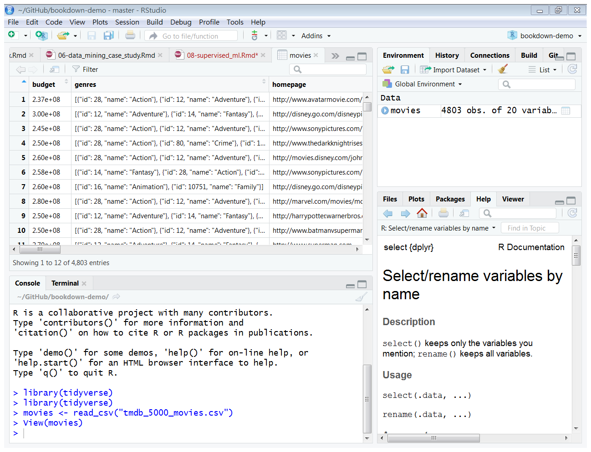

# 利用R語言進行監督式機器學習 {#supervised_machine_learning}

## 課程簡介 {-}

### 課程簡介 {-}

**分類**是根據蒐集的資料案例，以訓練演算法建立一個模型，來指定新的資料的類別。本次課程的目的為介紹監督式機器學習中的分類問題，並且利用TMDB電影資料，從片長、類型、製作公司、預算、收入、...等電影資料，預測電影的評分，進行分類的練習。本次課程包含以下的內容：

### 學習目標 {-}

## 監督式機器學習

監督式機器學習 (supervised machine learning)是利用一組已經標注結果的資料，預測尚未標注結果的新資料的可能結果。以數學的方式來表示這個概念，監督式機器學習利用一組資料 $X_{1}, X_{2}, ..., X_{N}$ 以及其對應的結果 $Y_{1}, Y_{2}, ..., Y_{N}$ ，設法找到一個模型 $f(x)$ ，盡可能使 $f(X_{1}) = Y_{1}$ 、 $f(X_{2}) = Y_{2}$ 、...、 $f(X_{N}) = Y_{N}$ 。當有新的資料 $\hat{X}$ 進入時，可以利用 $f(x)$ 計算的結果 $f(\hat{X})$ ，做為可能結果的預測。

---

通常來說，如果要預測的結果是連續的數值，通常將這類的問題稱為**迴歸 (regression)**，如果是離散型的結果的話，則稱為**分類 (classification)**。

### 分類

分類的問題可以視為運用現有的資料 $X_{1}, X_{2}, ..., X_{N}$ 以及其對應的類別 $Y_{1}, Y_{2}, ..., Y_{N}$ ，嘗試找到一個分類器模型 $f(x)$ 來預測新資料 $\hat{X}$ 的類別 $f(\hat{X})$ 。

常用的分類演算法:

- K-Nearest Neighbors演算法
- Naive Bayes 分類演算法
- 決策樹(devision tree)
- 

## TMDB電影評分預測

TMDB資料是[Kaggle](https://www.kaggle.com/)提供做為學習資料科學的資料集。Kaggle利用[TMDB (The Movie Database)](https://www.themoviedb.org/?language=zh-TW)提供的電影資料建立的資料集，大約有5000筆電影資料，在Kaggle上的下載點為[TMDB 5000 Movie Dataset](https://www.kaggle.com/tmdb/tmdb-movie-metadata/downloads/tmdb-5000-movie-dataset.zip/2)。


本次課程將利用TMDB資料集說明如何應用電影資料(片長、類型、製作公司、預算、收入、...等)，進行監督式機器學習，預測電影評分。可參考[Project Report: IMDB 5000 Movie Dataset](http://rstudio-pubs-static.s3.amazonaws.com/342210_7c8d57cfdd784cf58dc077d3eb7a2ca3.html#problem-statement)，有類似的做法。

### 載入tidyverse套件

載入`tidyverse`套件
```{r results='hide', message=FALSE, warning=FALSE}
library(tidyverse)
```

### 讀入資料

讀取TMDB資料集
```{r message=FALSE, warning=FALSE}
movies <- read_csv("tmdb_5000_movies.csv")
```



讀入資料後，先看資料的情況。

```{r}
str(movies)
```

```{r}
summary(movies)
```


### 資料的清除與整理

整理各個variable，分為以下四類

1. 電影編號：id
2. 與本次分析無關者：homepage, keywords, original_title, overview, production_countries, spoken_languages, status, tagline, title
3. 數值資料類型：budget, popularity, revenue, runtime, vote_average, vote_count
4. 日期資料類型：release_date
5. 簡單字串資料類型：original_language
6. 複雜字串資料類型：genres, production_companies

---

**處理與本次分析無關的variables**

與本次分析無關的variables，不需進一步分析，可以直接捨棄。
```{r}
movies <- movies %>%
  select(-homepage, -keywords, -original_title, -overview, -production_countries, -spoken_languages, -status, -tagline, -title)
```

捨棄這些variables後，資料集從20個variables，轉換為11個variables。

---

**整理數值資料類型的variables**

觀察每個數值資料的範圍
```{r}
movies %>%
  select(budget, popularity, revenue, runtime, vote_average, vote_count) %>%
  summary()
```

`budget`(預算)、`revenue`(收入)、`runtime`(放映時間)、`vote_count`(投票人數)等為0並不合理，首先刪除這些資料為0者
```{r}
movies <- movies %>%
  filter(budget>0 & revenue>0 & runtime>0 & vote_count>0)
```

再觀察每個數值資料的範圍
```{r}
movies %>%
  select(budget, popularity, revenue, runtime, vote_average, vote_count) %>%
  summary()
```

---

`budget`最小為1 ，看起來仍然不合理。顯示`budget`少於10000的電影共幾筆？
```{r}
print(paste("budget少於10000的電影數量：", nrow(movies[movies$budget<10000,])))
```

刪除`budget`少於10000的電影
```{r}
movies <- movies %>%
  filter(budget>=10000)
```

---

收入太少，也不正常，顯示`revenue`少於10000的電影共幾筆？
```{r}
print(paste("revenue少於10000的電影數量：", nrow(movies[movies$revenue<10000,])))
```

再刪除`revenue`少於10000的電影
```{r}
movies <- movies %>%
  filter(revenue>=10000)
```

---

分析`runtime`的分布情形
```{r}
summary(movies$runtime)
```

畫成直方圖看看
```{r}
movies %>%
  ggplot() +
  geom_histogram(aes(x=runtime), breaks=seq(0, 360, 30)) +
  scale_x_continuous(breaks=seq(0, 360, 30), minor_breaks = NULL) +
  labs(y="電影數量") +
  theme(panel.background = element_blank(),
        axis.line = element_line(color="grey"),
        panel.grid.major.y = element_line(color="grey90"))
```

刪除runtime小於60分鐘的電影
```{r}
movies <- movies %>%
  filter(runtime>=60)
```

---

最後分析`vote_count`，由於我們希望預測電影的評分資料，如果評分人數太少，評分可能較不準確。顯示`vote_count`少於100的電影共幾筆？
```{r}
print(paste("vote_count少於100的電影數量：", nrow(movies[movies$vote_count<100,])))
```

再刪除`vote_count`少於100的電影
```{r}
movies <- movies %>%
  filter(vote_count>=100)
```

---

我們要預測的目標是平均評分`vote_average`，檢視這個variable的分布情形。
```{r}
movies %>%
  ggplot() +
  geom_histogram(aes(x=vote_average), breaks=seq(0, 10, 0.5)) +
  scale_x_continuous(breaks=seq(0, 10, 0.5), minor_breaks = NULL) +
  labs(x="vote_average區間", y="電影數量") +
  theme(panel.background = element_blank(),
        axis.line=element_line(color="grey"),
        panel.grid.major.y = element_line(color="grey90"),
        axis.text.x = element_text(angle=60, hjust=1))
```

從上面的圖形可以發現資料分布在2.5到8.5之間
根據`vote_average`的分布情形，決定將這個variable分為x<=5.5, 5.5<x<=6.5, 6.5<x<=7.5以及7.5<x等四個區間，將`vote_average`改為新的變數`vote_average_p`，做為接下來預測的目標。也就是以其他的variables來預測`vote_average_p`在哪一個區間(類別)。

```{r}
movies <- movies %>%
  mutate(vote_average_p=cut(vote_average, breaks=c(0, 5.5, 6.5, 7.5, 10)))
```

檢視各類別內的資料數量
```{r}
movies %>%
  group_by(vote_average_p) %>%
  summarise(count=n()) %>%
  mutate(ratio=count/sum(count)) %>%
  ggplot() +
  geom_col(aes(x=vote_average_p, y=ratio)) +
  labs(x="vote_average_p類別", y="電影數量比率") +
  theme(panel.background = element_blank(),
        axis.line=element_line(color="grey"),
        panel.grid.major.y = element_line(color="grey90"))
```

---

捨棄`vote_count`和`vote_average`兩個variables
```{r}
movies <- movies %>%
  select(-vote_count, -vote_average)
```

---

**修改日期資料類型的variables成factor資料類型，然後轉換成one-hot encoding的形式**

說明： 

1. 因為輸入分類的variables最好是numeric，而且資料的分布比較平均比較好。因此先將日期資料型態改成factor資料型態，再轉變成one-hot encoding的形式。

2. one-hot encoding適用於名目或順序尺度的variables。對於某一個名目或順序尺度的variables，如果它有m個可能值，那麼經過one-hot encoding碼後，就變成了m個二元variables(0或1)。每一個二元variable表示原先的variable的一種可能值。例如，某一個variable(稱為light)的可能值為"red"、"yellow"和"green"，將light經過one-hot encoding後，將會產生3個二元variables(red、yellow和green)。如果某一個observation在light上的值是"red"，經過one-hot encoding後，這個observation在red上的值為1，yellow和green則都是0。

分析`release_date`，因為其資料型態是`Date`，所以載入日期時間處理套件
```{r results='hide', message=FALSE, warning=FALSE}
library(lubridate)
```

觀察`release_date`的分布情形
```{r}
summary(movies$release_date)
```
從1927年到2016年，最早期的電影數較少

查看每年的上映電影數
```{r}
movies %>%
  mutate(release_year=year(release_date)) %>%
  group_by(release_year) %>%
  summarise(count=n()) %>%
  ggplot() +
  geom_line(aes(x=release_year, y=count)) +
  scale_x_continuous(limits=c(1910, 2020), breaks=seq(1910, 2020, 10)) +
  labs(x="放映年份", y="電影數量") +
  theme(panel.background = element_blank(),
        panel.grid.major.y = element_line(color="grey70"),
        axis.line = element_line(color="grey"))
```

以放映年份取代放映日期，並分為1990年前、1991-2000年、2001-2010年與2011年後等四個區間，便於之後的分析
```{r}
movies <- movies %>%
  mutate(release_year=year(release_date)) %>%
  mutate(release_year=cut(release_year, breaks=c(1900, 1990, 2000, 2010, 2020), labels=c("before1990", "between1991_2000", "between2001_2010", "after2011")))
```

檢視各類別內的資料數量
```{r}
movies %>%
  group_by(release_year) %>%
  summarise(count=n()) %>%
  mutate(ratio=count/sum(count)) %>%
  ggplot() +
  geom_col(aes(x=release_year, y=ratio)) +
  labs(x="出品年代", y="電影數量比率") +
  theme(panel.background = element_blank(),
        axis.line=element_line(color="grey"),
        panel.grid.major.y = element_line(color="grey90"))
```

將release_year改為one-hot encoding的形式
```{r}
movies_year <- movies %>%
  select(id, release_year) %>%
  mutate(value=1) %>%
  spread(key=release_year, value=value, fill=0)
```

合併兩個data frame，捨棄`release_date`和`release_year`兩個variables
```{r}
movies <- movies %>%
  left_join(movies_year) %>%
  select(-release_date, -release_year)
```

---

**處理簡單字串類型的variables**

簡單字串資料類型與複雜資料的差別是前者的資料格式較單純，簡單字串資料類型只有一個variable：`original_language`。

分析`original_language`
```{r}
movies %>%
  group_by(original_language) %>%
  summarise(count=n()) %>%
  mutate(proportion=count/sum(count)) %>%
  arrange(desc(proportion))
```

可以發現雖然`original_language`中有許多可能的值，也就是收錄許多語言的電影，但絕大部分是英語片(96.64%)，因此捨棄這個variable
```{r}
movies <- movies %>%
  select(-original_language)
```

---
**處理複雜字串資料類型的variables**

IMDB 5000 Movie Dataset中，為了可以表示多個可能的值，`genres`(電影類型)和`production_companies`製作公司都是屬於較複雜的字串資料類型，而且都是以JSON的方式表示這些值。例如

```{r}
movies$genres[1]
```

因此，為了表示這些值，首先載入JSON的處理套件`jsonlite`。
```{r results='hide', message=FALSE, warning=FALSE}
library(jsonlite)
```

並且撰寫一個函數來取得這些variable上所有的資料
```{r}
valueExtract <- function (y) {
  x<- fromJSON(y)
  g <- paste(x$name, collapse="%") #每一個值之間以%分隔
  gsub(" ", "_", g) #將空白改為底線，便於進一步處理
}
```

首先處理所有電影的genres資料
```{r}
movies$genres_data <- sapply(movies$genres, valueExtract)
```

將電影的每一個genres展開
```{r}
movies_genres <- movies %>%
  select(id, genres_data) %>%
  mutate(genres_data=strsplit(genres_data, split="%")) %>%
  unnest(genres_data) %>%
  mutate(value=1)
```

統計每一個genre出現的電影數，並繪製成圖形
```{r}
movies_genres %>%
  group_by(genres_data) %>%
  summarise(count=sum(value)) %>%
  ggplot() +
  geom_col(aes(x=reorder(genres_data, count), y=count)) +
  coord_flip() +
  scale_y_continuous(limits=c(0, 1800), breaks=seq(0, 1800, 300)) +
  labs(x="類型", y="電影數") +
  theme(panel.background = element_blank(),
        panel.grid.major.x = element_line(color="grey"),
        axis.line =  element_line(color="grey"))
```
最多為Drama、Comedy、Thriller和Action，最少者如Western和Documentary。

將movies_genres從long format轉成wide format。將電影所屬的genres，設為1，不屬於的genres，設為0。
```{r}
movies_genres <- movies_genres %>%
  mutate(genres_data=paste0("g_", genres_data)) %>%
  spread(key=genres_data, value=value, fill=0)
```

合併兩個data frame，捨棄genres和genres_data兩個variables
```{r}
movies <- movies %>%
  left_join(movies_genres) %>%
  select(-genres, -genres_data)
```

---

分析`production_companies`
```{r}
movies$pc_data <- sapply(movies$production_companies, valueExtract)
```

將電影的每一個`production_companies`展開
```{r}
movies_pc <- movies %>%
  select(id, pc_data) %>%
  mutate(pc_data=strsplit(pc_data, split="%")) %>%
  unnest(pc_data) %>%
  mutate(value=1)
```

統計電影製作公司與他們製作的電影數 (按電影數排名)
```{r}
production_companies <- movies_pc %>%
  group_by(pc_data) %>%
  summarise(count=n()) %>%
  arrange(desc(count))
```

製作電影數前100的電影製作公司
```{r}
top100pc <- production_companies %>%
  slice(1:100) %>%
  pull(pc_data)
```

電影的製作公司包含幾家前100製作公司
```{r}
movies_pc <- movies_pc %>%
  mutate(value=ifelse(pc_data %in% top100pc, 1, 0)) %>%
  group_by(id) %>%
  summarise(top_pc_number=sum(value))
```

將電影的製作公司包含前100製作公司的數量與movies合併，捨棄production_companies和pc_data兩個variables，並且將top_pc_number的`NA`值改為0。
```{r}
movies <- movies %>%
  left_join(movies_pc) %>%
  select(-production_companies, -pc_data) %>%
  mutate(top_pc_number=ifelse(is.na(top_pc_number), 0, top_pc_number))
```

繪製電影的知名製作公司數量分布情形
```{r}
movies %>%
  mutate(top_pc_number=factor(top_pc_number)) %>%
  group_by(top_pc_number) %>%
  summarise(count=n()) %>%
  mutate(ratio=count/sum(count)) %>%
  ggplot() +
  geom_col(aes(x=top_pc_number, y=ratio)) +
  labs(x="包含知名製作公司數", y="電影數量比率") +
  theme(panel.background = element_blank(),
        panel.grid.major.y = element_line(color="grey90"),
        axis.line =  element_line(color="grey"))

```

---

在進行資料探勘前，最後再檢視一次movies
```{r}
summary(movies)
```

捨棄variable `id`
```{r}
movies <- movies %>%
  select(-id)
```

### 轉換資料為有效描述和預測的特徵

載入套件
```{r results='hide', message=FALSE, warning=FALSE}
library(caret)
```

**建立訓練資料與測試資料**

將TMDB電影資料分為訓練集與測試集，訓練資料用來訓練各種分類器，測試資料比較各種分類器的成效。
```{r}
sd <- round(second(Sys.time())*100)

set.seed(sd)

# Step 1: Get row numbers for the training data
trainRowNumbers <- createDataPartition(movies$vote_average_p, p=0.8, list=FALSE)

# Step 2: Create the training  dataset
train_set <- movies[trainRowNumbers,]

# Step 3: Create the test dataset
test_set <- movies[-trainRowNumbers,]
```

調整每個variable的值，前四個variables(budget, popularity, revenue, run_time)根據平均數和標準差進行調整，最後一個variable(top_pc_number)調整為0與1之間
```{r}
preprocessParams_1 <- preProcess(train_set[,1:4], method=c("center", "scale"))
train_set[,1:4] <- predict(preprocessParams_1, train_set[,1:4])
test_set[,1:4] <- predict(preprocessParams_1, test_set[,1:4])

preprocessParams_2 <- preProcess(train_set[,ncol(train_set)], method=c("range"))
train_set[,ncol(train_set)] <- predict(preprocessParams_2, train_set[,ncol(train_set)])
test_set[,ncol(train_set)] <- predict(preprocessParams_2, test_set[,ncol(train_set)])
```

## 進行K-Nearest Neightbors分類

K-Nearest Neightbors分類演算法(以下簡稱KNN)，是最直覺的分類演算法。有別於其他監督式機器學習的分類演算法，KNN不需要先利用已經知道類別的資料訓練預測模型，其主要的概念是將要預測的資料與已經知道類別的資料進行比對，找出最相似的K個資料(因此稱為K-Nearest Neighbors)，然後對這K個資料統計每個類別的數量，以多數決的方式決定要預測的資料類別。

KNN雖然概念簡單，但還有不錯的結果。因此，常常用來作為其他分類演算法的比較基準。

FNN套件提供KNN分類演算法。安裝後，載入套件
```{r results='hide', message=FALSE, warning=FALSE}
library(FNN)
```

以**交互驗證(cross validation, cv)**的方式，找出K為x時，KNN的準確度。cv是將資料分成多個部分，每一次取出一個部分當做測試資料，以其他部分作為訓練資料，建立預測模型，預測測試資料的結果，估算這個模型的準確度。然後，再取出未曾測試的另一部份資料做為測試資料，以其他部分做為訓練資料，估算準確度。反覆多次，最後將所有獲得的準確度進行平均，做為準確度的估計值。

```{r}
test_k <- function (x) {
  train_res <- knn.cv(subset(train_set, select=-vote_average_p),
                      cl=train_set$vote_average_p, k = x)
  acc <- confusionMatrix(train_res, train_set$vote_average_p)
  return(acc$overall[1])
}
```

從K=1到20分別測試，找出最大準確度的K值。
```{r}
accu <- sapply(1:20, test_k)
```

計算測試資料的準確度
```{r}
knn_res <- knn(subset(train_set, select=-vote_average_p),
               subset(test_set, select=-vote_average_p),
               cl=train_set$vote_average_p, k=which.max(accu))
confusionMatrix(knn_res, test_set$vote_average_p)$overall[1]
```


## 進行Naive Bayes演算法分類

```{r}
library(naivebayes)
```

```{r}
NB_model <- naive_bayes(vote_average_p ~ ., 
                               usekernel=TRUE, data=train_set)
```

```{r}
test_set1 <- test_set %>%
  select(-vote_average_p)

NB_res <- predict(NB_model, newdata=test_set1, type="class")


confusionMatrix(NB_res, test_set$vote_average_p)$overall[1]
```

## 進行支持向量機分類

支持向量機(Support Vector Machine, SVM)試圖從訓練資料中找到一個超平面(hyperplane)，將訓練資料區分成兩個具有最大差異的類別。以下圖為例，可以發現右圖上的超平面具有最好的分類結果，因為該超平面距離兩個類別上所有的資料是最大的情形。用來找到這個超平面的資料便稱為支持向量(Support Vectors)，例如在右圖上以實心表現的資料點。當新資料需要進行分類時，便根據超平面判斷新資料的類別。


由於SVM原本的應用是針對兩個類別的問題，在將SVM應用到多個類別時，需要採用One-against-One的策略，也就是對每兩個類別分別建立一個SVM模型，所以若是有M個類別的話，便須建立$\frac{M(M-1)}{2}$個SVM模型。當新資料輸入後，便以這立$\frac{M(M-1)}{2}$個SVM模型進行預測，以多數決決定預測的類別。

e1071套件中提供SVM分類演算法。先安裝後，再載入該套件。
```{r}
library(e1071)
```

利用訓練資料進行分類模型訓練
```{r}
SVM_model <- svm(vote_average_p ~ ., 
                 data=train_set)
```

預測測試資料的類別，計算其準確度
```{r}
SVM_res <- predict(SVM_model, newdata=test_set, type="class")

confusionMatrix(SVM_res, test_set$vote_average_p)$overall[1]
```

## 進行決策樹分類

機器學習中，決策樹是一種樹型結構的分類方法，在樹型結構的第一層分支上對全體的資料依照某一個條件進行分類，分類後盡量使同一群內的資料具有相同的輸出資訊，也就是提高輸出資訊的純度。然後在接下來的第二層分支，再分別對這兩群資料進行分類，使得分類後的結果純度再提高。反覆進行上述的分類過程，當不能再進行分類或一個單獨的類可以被應用於某一分支時，決策樹的建置就完成了。


套件`rpaprt`提供決策樹應用。安裝`rpaprt`套件後，載入這個套件。
```{r results='hide', message=FALSE, warning=FALSE}
library(rpart)
```

輸入train_set的資料訓練分類樹
```{r}
rpart_model <- rpart(vote_average_p ~ .,
                     data = train_set, method = "class",
                     minsplit=30, cp=0.00001, xval=5)
```

顯示訓練的結果
```{r}
printcp(rpart_model)
```

訓練完成之後，決策樹如果太大，會有過度擬合(overfitting)的問題，也就是太像訓練資料。對於沒有參與訓練的資料，表現可能不理想。所以分類樹通常會經過裁減(pruning)，選擇預測能力較好的部分，也就是上面xerror最小的cp值。

xerror最小值
```{r}
min(rpart_model$cptable[, "xerror"])
```

xerror最小的層級
```{r}
which.min(rpart_model$cptable[, "xerror"])
```

xerror最小的cp值
```{r}
rpart_model$cptable[which.min(rpart_model$cptable[, "xerror"]), "CP"]
```

以xerror最小的cp值進行裁減
```{r}
pruned.tree <- prune(rpart_model,
                     cp = rpart_model$cptable[which.min(rpart_model$cptable[,"xerror"]),"CP"])
```

以訓練好的分類模型進行測試資料(test_set)分類的成效
```{r}
test_res <- predict(pruned.tree, test_set, type = "class")

confusionMatrix(test_res, test_set$vote_average_p)$overall[1]
```

## 進行隨機森林監督式學習

載入隨機森林套件
```{r results='hide', message=FALSE, warning=FALSE}
library(randomForest)
```

```{r}
rf_model <- randomForest(vote_average_p ~ ., data = train_set)
```

```{r}
importance <- importance(rf_model)
data.frame(variable=dimnames(importance)[[1]],
           MeanDecreaseGini=importance,
           stringsAsFactors = FALSE) %>%
  arrange(desc(MeanDecreaseGini)) %>%
  slice(1:10) %>%
  ggplot() +
  geom_col(aes(x=reorder(variable, MeanDecreaseGini), y=MeanDecreaseGini)) +
  coord_flip()
```

```{r}
rf_res <- predict(rf_model, test_set)

confusionMatrix(rf_res, test_set$vote_average_p)$overall[1]
```

## 隨機梯度增強

```{r results='hide', message=FALSE, warning=FALSE}
library(gbm)
```

```{r}
gbm_model <- gbm(vote_average_p ~ ., data = train_set,
                 distribution="multinomial", n.trees = 1000,
                 cv.folds = 10)
```

```{r}
best_iter <- gbm.perf(gbm_model, method="cv")
```

```{r}
gbm_res <- predict(gbm_model, test_set, n.trees=best_iter)

gbm_res_labels <- as.factor(colnames(gbm_res)[apply(gbm_res, 1, which.max)])

confusionMatrix(gbm_res_labels, test_set$vote_average_p)$overall[1]
```

## 類神經網路
```{r results='hide', message=FALSE, warning=FALSE}
library(nnet)
```

```{r results='hide', message=FALSE, warning=FALSE}
nnet_model <- nnet(vote_average_p ~ ., data = train_set, linout = TRUE, size = 30, decay = 0.001, maxit = 5000)
```

```{r}
nnet_res <- predict(nnet_model, test_set, type = 'class')

confusionMatrix(as.factor(nnet_res), test_set$vote_average_p)$overall[1]
```

